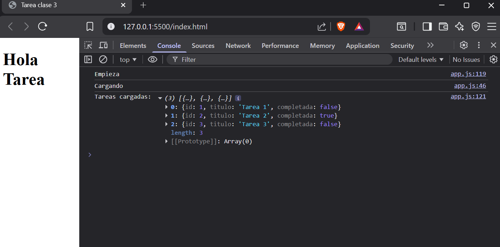

# tarea-clase-3

## Formulario interactivo con validación en clases

### Objetivo
Practicar uso 
-De setTimeout o Promise para simular asincronía.
-Creación de clases con propiedades y métodos.
-Manipulación de datos con map, filter y find.

### Procedimiento
#### Un documento JavaScript con:
##### Clase
Una clase Tarea con:
- Propiedades: id, titulo, completada (booleano).
- Método toggleEstado() que cambie completada a su valor contrario.

Una clase GestorTareas que:
-Contenga un array de tareas.
-Método agregarTarea(titulo) → crea una nueva tarea y la agrega al array.
-Método listarTareas() → usa forEach para mostrar todas las tareas en consola.
-Método buscarPorTitulo(titulo) → usa find para devolver la tarea que coincida.
-Método listarCompletadas() → usa filter para devolver las tareas con completada en true.

##### Simulación asíncrona
-Una función cargarTareas() que devuelva una promesa y simule la carga inicial de datos con setTimeout (2 segundos).
-Dentro del resolve, devolver un array con 3 tareas iniciales.

##### Flujo del programa
-async/await para:
    -Esperar a cargarTareas() y asignar los resultados al GestorTareas.
    -Mostrar un mensaje en consola: “Tareas cargadas correctamente”.
    -Listar las tareas.
-Agregar una nueva tarea y luego mostrar la lista actualizada.
-Filtrar y mostrar las tareas completadas.
-map para crear un nuevo array con los títulos de las tareas y mostrarlo en consola.
-Aplicar Promise.all para simular la carga de tareas y otra operación en paralelo (ej. cargar usuarios).

- - - 

https://github.com/Filipc-zak/tarea-clase-3.git

- - - 

- - -

Creditos: Bruno Borelli, Curso: 999201563, Módulo 1 Unidad 3.